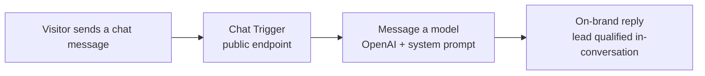
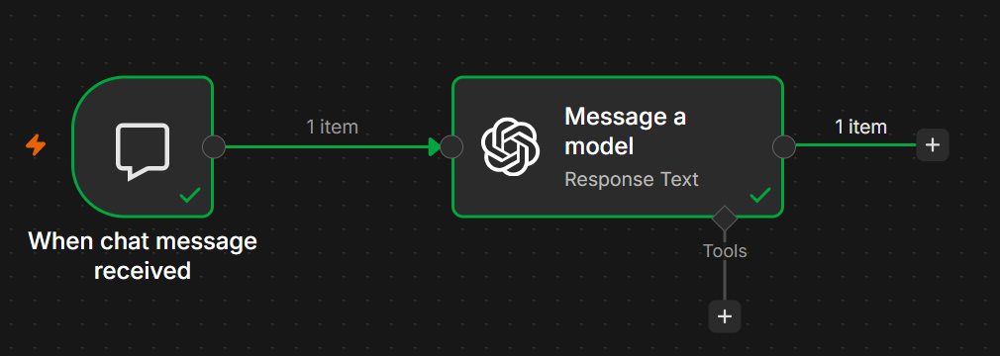

# n8n AI Chatbot — "First Chatbot"

> An AI-powered customer assistant built in n8n. My first working conversational agent, and the start of a deliberate path toward mastering business automation.


---

## The Story

Every automation engineer has a first working agent. This is mine.

I set out to answer one question: *can I take a real business problem and solve it with an AI workflow, end to end, not just a demo?* The result is a small but complete conversational assistant for **Insight Analytics**, a Zambian AI and automation consultancy. A visitor sends a message, the workflow routes it to a language model with a carefully written system prompt, and the assistant replies in a warm, on-brand voice that qualifies the lead and explains what the business can do.

It is intentionally simple. That is the point. Simple, working, and shippable beats complex and half-finished. This repository is the first checkpoint in an ongoing commitment: build one real automation at a time, document it properly, and get measurably better with each one.

---

## Problem

Small businesses lose leads in the gap between "a visitor is interested" and "someone is free to reply." Questions arrive after hours. First responses are slow. The same introductory questions get answered by hand, over and over. That repetitive front-line work is exactly what should be automated first.

## Solution

A lightweight n8n workflow that puts an AI assistant on the front line:

1. A chat message comes in through a public chat trigger.
2. The message is passed to an OpenAI chat model.
3. A tightly scoped system prompt shapes every reply: keep it short and conversational, stay on brand, capture the lead's name, business, and problem, and never invent pricing or client stories.
4. The assistant responds instantly, any time of day.

The heavy lifting is in the prompt design, not the node count. Good automation is as much about clear instructions as it is about wiring.

---

## Features

- **Instant, always-on first response** to website or chat visitors.
- **Brand-controlled tone** — warm, local, professional, never generic corporate.
- **Lead capture built into the conversation** — name, business, and the problem to solve.
- **Guardrails against hallucination** — the assistant is instructed never to invent pricing, client names, or case studies, and to hand off to a human when unsure.
- **Retainer-safe pricing behavior** — it explains the engagement model and books a call instead of quoting numbers.
- **Portable** — the entire workflow is a single importable JSON file.

---

## Tech Stack

| Layer | Tool |
|-------|------|
| Orchestration | [n8n](https://n8n.io) (workflow automation) |
| Language model | OpenAI chat model via `@n8n/n8n-nodes-langchain` |
| Trigger | n8n Chat Trigger (public chat endpoint) |
| Format | Portable workflow JSON |

---

## Architecture



**Flow in words:** a visitor's message hits the chat trigger, which passes the text straight to the model node. That node carries the system prompt that defines the assistant's personality, boundaries, and lead-capture goals. The model's reply goes back to the visitor. Two nodes, one clear job, done well.

---

## Screenshots

The workflow running in n8n, with a message processed end to end and "Workflow executed successfully":



---

## Installation

You need a running n8n instance (cloud or self-hosted) and an OpenAI API key.

1. Clone this repository:
   ```bash
   git clone https://github.com/buseko-Actuary/n8n-ai-chatbot.git
   ```
2. In n8n, go to **Workflows → Import from File**.
3. Select `workflow/first-chatbot.json`.
4. Open the **Message a model** node and connect your own OpenAI credential.
5. Activate the workflow and open the chat URL from the Chat Trigger node.

---

## Environment Variables / Credentials

This project stores no secrets in the repository. You supply your own credential inside n8n:

| Credential | Where | Purpose |
|------------|-------|---------|
| OpenAI API key | n8n → Credentials → OpenAI | Authenticates the chat model node |

> The workflow JSON references a credential by n8n's internal ID only. No API key is included in this repo, and none should ever be committed.

---

## Usage

Once activated, open the chat endpoint exposed by the Chat Trigger node. Try messages like:

- "Hi, what does Insight Analytics do?"
- "I spend hours every week sending the same reports by hand."
- "How much do you charge?"

The assistant will respond in character, ask qualifying questions, and steer pricing conversations toward a scoping call rather than quoting figures.

---

## Folder Structure

```
n8n-ai-chatbot/
├── workflow/
│   └── first-chatbot.json     # Importable n8n workflow
├── assets/
│   └── chatbot-canvas.png      # Screenshot of the running workflow
├── LICENSE
├── .gitignore
└── README.md
```

---

## Future Improvements

This is a foundation, and the roadmap is deliberate:

- [ ] Log every captured lead to Google Sheets or a CRM.
- [ ] Add memory so the assistant remembers context across a conversation.
- [ ] Connect the assistant to WhatsApp for real customer channels.
- [ ] Add a retrieval (RAG) layer so it can answer from real service documents.
- [ ] Route qualified leads to a human with an automatic notification.
- [ ] Add basic analytics on questions asked and lead conversion.

Each item is its own learning milestone. The list will shrink, one shipped feature at a time.

---

## About This Repo

This is part of an ongoing effort to build practical, business-focused automation systems and document them to a professional standard. The goal is not a portfolio of toys, but a growing record of real problems solved with AI and workflow automation.

---

## Contact

**Buseko Fungamwango** — AI & Automation Engineer, Insight Analytics

- GitHub: [@buseko-Actuary](https://github.com/buseko-Actuary)
- Company: Insight Analytics (Lusaka, Zambia) — turning data and repetitive work into automated systems

---

## License

Released under the [MIT License](LICENSE).
