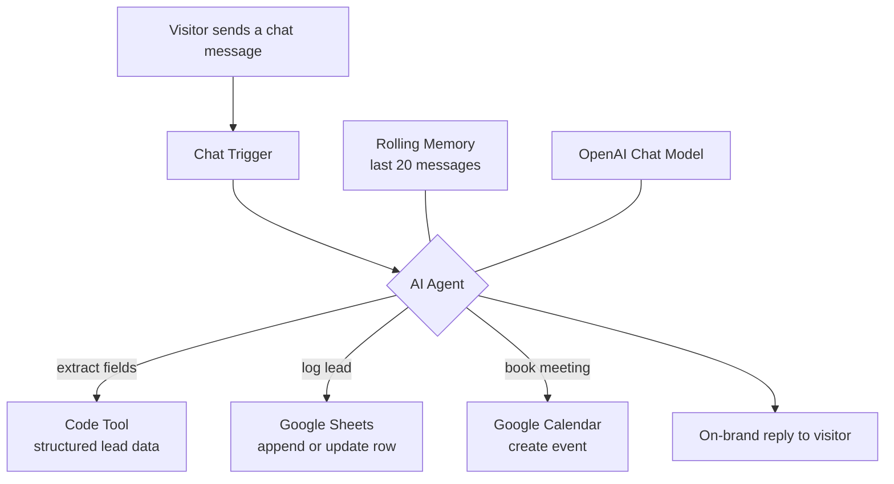
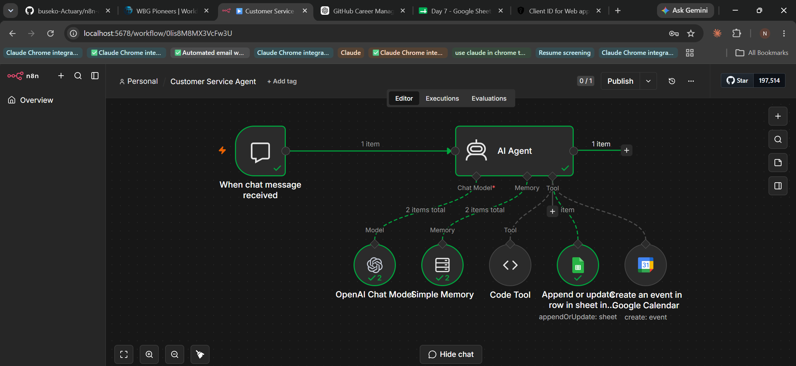

# n8n AI Chatbot → AI Agent

> From a simple chatbot to a working AI agent that talks to customers, captures leads, logs them to a spreadsheet, and books meetings on a calendar — all on its own. This repo tracks that journey and my ongoing commitment to mastering automation for real businesses.


---

## The Story So Far

Every automation engineer has a first working agent. This repository holds mine, and it shows the leap between two versions built days apart.

**Version 1 — First Chatbot.** Two nodes. A visitor sends a message, a language model replies in Insight Analytics' voice. Simple, working, shippable. It proved the idea.

**Version 2 — AI Agent.** The same friendly assistant, now with real capability. It remembers the conversation, decides when to act, and reaches for tools on its own: it extracts the lead's details, writes them straight into a Google Sheet, and books a meeting on Google Calendar. No human touches the handoff. The visitor just has a conversation, and by the end a qualified lead is logged and a meeting is on the calendar.

That jump — from a bot that *talks* to an agent that *does* — is the whole point. It is the difference between a demo and a system a business can actually run on.

---

## Why This Matters for Zambian Businesses

This is where it gets genuinely exciting.

Most small and medium businesses in Zambia lose customers in the quiet hours. An enquiry comes in at 9pm on WhatsApp or a website chat, and by the time someone replies the next morning, the customer has moved on. Front desks are stretched. The same questions get answered by hand, all day, every day. Follow-ups get forgotten. Leads leak out of the business unseen.

An agent like this closes that gap. Picture a Lusaka SME that cannot afford a 24-hour sales team:

- A customer chats at any hour and gets an instant, on-brand reply.
- Their name, business, and problem are captured mid-conversation and written to a shared sheet the team can see the next morning.
- If they are serious, a meeting is already booked on the owner's calendar before the conversation ends.
- The agent even sorts serious buyers from casual browsers, so the team spends its time where it counts.

That is a full-time sales-and-admin assistant that never sleeps, never forgets a lead, and costs a fraction of a salary. For a small Zambian business, that is not a small convenience. It is the kind of leverage that used to belong only to large companies with big teams and expensive software. Putting that within reach of a shop, a clinic, a courier company, or a training centre in Lusaka can genuinely change how they grow.

The technology is not the point. The point is what it unlocks for businesses that were never able to afford this before.

---

## Problem

Small businesses lose leads in the gap between "a visitor is interested" and "someone is free to help." Enquiries arrive after hours. First responses are slow. Details get lost. Follow-ups slip. The repetitive front-line work of greeting, qualifying, recording, and scheduling is exactly what should be automated first.

## Solution

A conversational **AI agent** built in n8n that handles the entire front line:

1. A visitor sends a chat message.
2. The agent replies in Insight Analytics' voice, guided by a tightly scoped system prompt.
3. It **remembers** the conversation using a rolling memory window.
4. It uses tools when needed:
   - A **code tool** that extracts structured lead data (name, email, query, appointment, buyer type) from messy free text.
   - **Google Sheets** to append or update the lead as a row.
   - **Google Calendar** to create a meeting with the visitor as an attendee.
5. The result: a qualified, logged lead and a booked meeting, with no manual steps.

---

## The Two Versions in This Repo

| | Version 1 — First Chatbot | Version 2 — AI Agent |
|---|---|---|
| File | `workflow/first-chatbot.json` | `workflow/ai-agent-lead-capture.json` |
| Nodes | 2 | 7 |
| Behaviour | Replies to messages | Replies, remembers, and takes actions |
| Memory | None | Rolling 20-message window |
| Lead capture | In conversation only | Extracted and written to Google Sheets |
| Scheduling | None | Books meetings in Google Calendar |
| Lead scoring | None | Classifies serious vs. casual buyers |

Keeping both files side by side is deliberate. It shows the progression, not just the finished product.

---

## Features

- **Always-on, on-brand conversation** with visitors, any hour of the day.
- **Conversation memory** so the agent keeps context across a chat.
- **Autonomous tool use** — the agent decides when to extract data, log a lead, or book a meeting.
- **Automatic lead capture** into Google Sheets (append or update by email).
- **Automatic meeting booking** in Google Calendar with the visitor added as an attendee.
- **Lead qualification** that separates serious buyers from casual enquiries.
- **Guardrails against hallucination** — never invents pricing, client names, or case studies; hands off to a human when unsure.
- **Clean, importable templates** — no private data committed; you plug in your own credentials.

---

## Tech Stack

| Layer | Tool |
|-------|------|
| Orchestration | [n8n](https://n8n.io) |
| Agent framework | `@n8n/n8n-nodes-langchain` (Agent, Chat Trigger, Memory, Tools) |
| Language model | OpenAI chat model |
| Lead storage | Google Sheets |
| Scheduling | Google Calendar |
| Custom logic | JavaScript code tool for structured extraction |

---

## Architecture



**Flow in words:** the visitor's message reaches the agent, which is backed by an OpenAI model and a rolling memory. The agent decides, turn by turn, whether to answer directly or call a tool. It can clean up a lead's details with the code tool, write them to Google Sheets, and place a meeting on Google Calendar, then reply naturally. One agent, several tools, a complete front-office loop.

---

## Screenshots

The AI agent running in n8n, with the agent wired to its model, memory, and tools:



The original two-node First Chatbot, executed successfully:


---

## Installation

You need a running n8n instance (cloud or self-hosted), an OpenAI API key, and Google (Sheets + Calendar) credentials.

1. Clone this repository:
   ```bash
   git clone https://github.com/buseko-Actuary/n8n-ai-chatbot.git
   ```
2. In n8n, go to **Workflows → Import from File**.
3. Import either workflow:
   - `workflow/first-chatbot.json` (the simple version), or
   - `workflow/ai-agent-lead-capture.json` (the full agent).
4. Open each node marked `REPLACE_WITH_...` and connect your own credentials.
5. Set your Google Sheet ID and your calendar email where the placeholders are.
6. Activate the workflow and open the chat URL from the Chat Trigger node.

---

## Environment Variables / Credentials

No secrets are stored in this repository. You supply your own inside n8n. The committed files use clearly named placeholders:

| Placeholder in the workflow | What to provide |
|-----------------------------|-----------------|
| `REPLACE_WITH_YOUR_OPENAI_CREDENTIAL` | Your OpenAI credential in n8n |
| `REPLACE_WITH_YOUR_GOOGLE_SHEETS_CREDENTIAL` | Your Google Sheets OAuth2 credential |
| `REPLACE_WITH_YOUR_GOOGLE_CALENDAR_CREDENTIAL` | Your Google Calendar OAuth2 credential |
| `REPLACE_WITH_YOUR_GOOGLE_SHEET_ID` | The ID of the sheet that stores leads |
| `your-email@example.com` | The calendar owner / attendee email |

> Never commit real API keys, sheet IDs, or personal emails to a public repository.

---

## Usage

Once activated, open the chat endpoint exposed by the Chat Trigger node and try:

- "Hi, what does Insight Analytics do?"
- "I run a shop and spend hours logging orders by hand. Can you help?"
- "Can we set up a call on Thursday afternoon? My email is name@business.com."

The agent will respond in character, qualify the enquiry, log the lead to your sheet, and offer to book a meeting on your calendar.

---

## Folder Structure

```
n8n-ai-chatbot/
├── workflow/
│   ├── first-chatbot.json            # Version 1 — simple chatbot
│   └── ai-agent-lead-capture.json    # Version 2 — full AI agent with tools
├── assets/
│   ├── chatbot-canvas.png            # Screenshot of Version 1 running
│   └── ai-agent-canvas.png           # Screenshot of Version 2 running
├── LICENSE
├── .gitignore
└── README.md
```

---

## Future Improvements

The roadmap is deliberate, and each item is its own milestone:

- [ ] Connect the agent to WhatsApp so real customers can chat on the channel they already use.
- [ ] Add a retrieval (RAG) layer so the agent answers from real Insight Analytics service documents.
- [ ] Send an instant notification to the team whenever a serious lead is captured.
- [ ] Add a simple dashboard on the leads sheet to track enquiries and conversion.
- [ ] Support follow-up messages for leads who go quiet.
- [ ] Add multi-language support, including local languages, for wider reach in Zambia.

---

## About This Repo

This is part of an ongoing effort to build practical, business-focused automation systems and document them to a professional standard. Not a portfolio of toys — a growing record of real problems solved with AI and workflow automation, aimed squarely at the businesses that stand to gain the most.

---

## Contact

**Buseko Fungamwango** — AI & Automation Engineer, Insight Analytics

- GitHub: [@buseko-Actuary](https://github.com/buseko-Actuary)
- Company: Insight Analytics (Lusaka, Zambia) — turning data and repetitive work into automated systems

---

## License

Released under the [MIT License](LICENSE).
